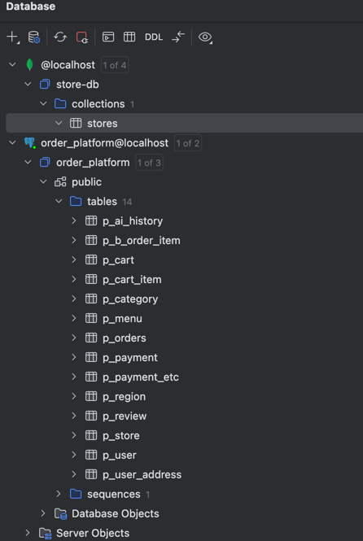

**로컬 개발용 MSA 엔티티 리포지토리**

[3줄 요약]

필수 단계
.env entity-repo 안에 넣기
-> 켜진 컨테이너 모두 삭제 ex. `docker compose down`
-> docker compose up

옵션 1. 터미널이 entity repo가 루트일때 ./gradlew bootRun
옵션 2. root 프로젝트에 settings.gradle에 entity repository **include** 하고 **Intellij**에서 `entityRepository.java` 마우스 우클릭으로 실행

## 개요

이 리포지토리는 'Order Platform MSA' 프로젝트의 여러 마이크로서비스에 있는 JPA 엔티티들을 한곳에 모아두었습니다. 주 목적은 로컬 개발 환경에서 데이터베이스 스키마를 통일되고 쉽게 관리할 수 있도록 하는 것입니다.

## 주요 기능

* **중앙 집중식 엔티티 관리:** 각기 다른 마이크로서비스의 모든 JPA 엔티티들을 한 리포지토리에 통합했습니다.
* **도커 기반 데이터베이스:** `docker-compose.yml` 파일이 포함되어 있어 도커 컨테이너에서 PostgreSQL 데이터베이스를 쉽게 실행할 수 있습니다.
* **자동 스키마 초기화:** 이 리포지토리의 Spring Boot 애플리케이션을 실행하면, `spring.jpa.hibernate.ddl-auto: create` 설정에 따라 중앙 집중식 엔티티들을 기반으로 데이터베이스 스키마가 자동으로 생성됩니다.

## 시작하기

1.  **프로젝트 클론:**
    루트 프로젝트 디렉토리 안에서 이 리포지토리를 `entity-repository`라는 이름의 하위 모듈로 클론합니다.

    ```bash
    git clone https://github.com/profect-team3/entity-repository.git
    ```


---

# 상세 설명

## MSA 로컬 개발 환경 설정 가이드

이 가이드는 멀티 모듈 프로젝트 환경에서 `entity-repository` 모듈을 사용하여 데이터베이스 스키마를 초기화하는 방법을 설명합니다. 이 과정을 통해 PostgreSQL, Redis, MongoDB 컨테이너를 올바르게 설정하고, 엔티티 스키마를 자동으로 생성할 수 있습니다.

### **1단계: 환경 변수 설정**

`.env` 파일은 데이터베이스 접속 정보와 같은 민감한 환경 변수를 관리하는 데 사용됩니다. `docker-compose.yml`이 상위 폴더의 `.env` 파일을 참조하도록 설정되어 있으므로, `.env` 파일을 **루트 프로젝트 디렉토리**에 위치시켜야 합니다.

- `docker-compose.yml` 파일이 있는 `entity-repository` 폴더의 \*\*상위 폴더(루트 프로젝트)\*\*에 `.env` 파일을 저장합니다.

-----

### **2단계: 데이터베이스 컨테이너 실행**

환경 변수 설정이 변경되거나 기존 컨테이너에 문제가 있을 경우, 다음 명령어를 통해 컨테이너를 초기화해야 합니다.

1.  **기존 컨테이너 삭제**: `entity-repository` 디렉토리에서 다음 명령어를 실행하여 현재 실행 중인 모든 컨테이너를 중지하고 삭제합니다.
    ```bash
    docker-compose down
    ```
2.  **새 컨테이너 시작**: `.env` 파일의 환경 변수를 적용하여 데이터베이스 컨테이너들을 시작합니다.
    ```bash
    docker-compose up -d
    ```
    이 명령어를 실행하면 PostgreSQL, Redis, MongoDB 컨테이너가 백그라운드에서 실행됩니다.

-----

### **3단계: 데이터베이스 스키마 초기화**

이제 컨테이너가 준비되었으므로 `entity-repository` 모듈의 Spring Boot 애플리케이션을 실행하여 데이터베이스 스키마를 초기화합니다.

#### **옵션 1: 터미널에서 실행**

**build.grdle에서 *주석 해제*  필요**

`entity-repository` 디렉토리에서 다음 Gradle 명령어를 실행합니다. 이 명령어는 Spring Boot 애플리케이션을 실행하고, 애플리케이션 시작 시점에 엔티티를 기반으로 모든 테이블과 컬렉션을 자동으로 생성합니다.

```bash
./gradlew bootRun
```

#### **옵션 2: IntelliJ IDEA에서 실행**

1.  **모듈 포함**: `settings.gradle` 파일에 `include 'entity-repository'`가 올바르게 설정되어 있는지 확인합니다.
2.  **애플리케이션 실행**: IntelliJ IDEA 프로젝트 탐색기에서 `entityRepository/src/main/java/app/entityRepository/entityRepository.java` 파일을 찾습니다. 파일 내용을 열고, 마우스 오른쪽 버튼을 클릭한 후 \*\*'Run `entityRepositoryApplication`'\*\*을 선택하여 애플리케이션을 실행합니다.

## 데이터베이스 보기
.env 를 참고해서 데이터베이스 이름, username, password를 참고해서 intellij에서 확인가능
